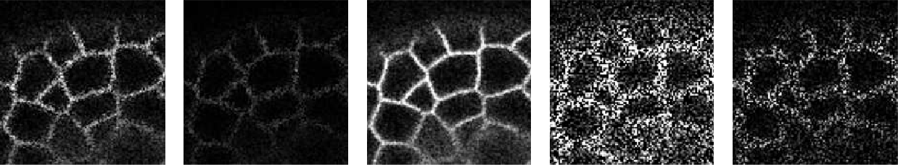
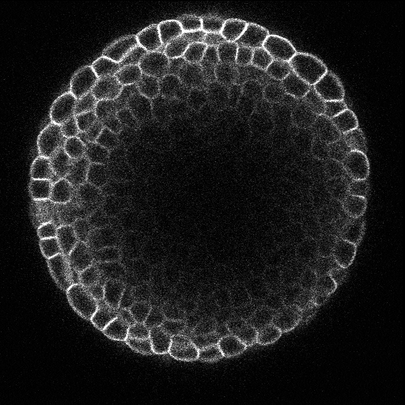

## Probabilistic Image Diversification to Improve Segmentation in 3D Microscopy Image Data
<br>
This repository contains code to diversify 3D microscopy image data based on local intensity statictics to generate realistically altered appearances in a controllable way.<br><br>
<br>
To generate different appearances, the raw image $I$ and the estimated local variance $\sigma$ are used to reparametrize a standard normal distribution $\mathcal{N}$ at each position $\mathbf{x}=(x,y,z)$, following:<br><br>
$$\tilde{I}(\mathbf{x}) = \mathcal{N}(0,1)\cdot w_v\cdot\sigma_\mathbf{x} + w_i\cdot I_\mathbf{x}$$

Weights $w_i$ and $w_v$ control the influence of raw image and variance, respectively.<br>

Besides being useful as augmentation strategy for, e.g., training deep learning-based segmentation approaches, the proposed approach can also be used to generated realistic benchmark image data sets, e.g., by increasing the PSNR of an image (see image below).<br><br>
<br>

Please refer to `demo_code.ipynb` for a brief overview of the functionality and `utils.py` for a collection of all auxiliary functions.
If you are using the code, please consider citing the work mentioned below. The application method and the data used in this work are publicly available at ([Code-Paper](https://arxiv.org/abs/2105.00794), [Code-Repository](https://github.com/stegmaierj/Cellpose3D)) and (real [Data-Paper](https://www.pnas.org/doi/10.1073/pnas.1616768113), [Data-Repository](https://www.repository.cam.ac.uk/handle/1810/262530))/(synthetic [Data-Paper](https://journals.plos.org/plosone/article?id=10.1371/journal.pone.0260509), [Data-Repository](https://osf.io/e6n7b/)).

```
@inproceeding{eschweiler2022diversify,
  title={Probabilistic Image Diversification to Improve Segmentation in 3D Microscopy Image Data},
  author={Dennis Eschweiler and Justus Schock and Johannes Stegmaier},
  booktitle={MICCAI International Workshop on Simulation and Synthesis in Medical Imaging (SASHIMI)},
  year={2022}
}
```
